# Advanced Technical Interview Preperation Problems and Solutions :watch:
Presented by UCLA ACM ICPC   
Questions: https://tinyurl.com/ask-ucla-icpc <br />
ICPC Facebook Group: https://www.facebook.com/groups/ucla.icpc/

<p>Hello there! Welcome to the Advanced Technical Interview Guide presented to you by ACM ICPC. If you are looking to boost your
technical skills, this is a great place to get started. If you have no idea about the types of questions you would encounter in a technical interview, make sure to check out our CS32 interview prep guide first and then make sure to come back. If you have already, you're in the right place.</p>

# Table of Contents :zap:
1. [Arrays](#arrays)
2. [Strings](#strings)
3. [Linked Lists](#linkedlists)
4. [Trees I](#trees1)
5. [Trees II](#trees2)
6. [Graphs](#graphs)
7. [Recursion and Dynamic Programming](#recursionanddynamicprogramming)
8. [Topological and Heap Sort](#topologicalandheapsort)

# Arrays <a name="arrays"></a> :dolphin:
<p>Array questions, often interchangeable with string questions are some of the most common questions asked during technical interviews. As we have learned previously, what makes arrays so popular is their simplicity in storing data. When dealing with arrays you want to deal with an algorithm that is in the O(N) or O(log(N)) ballpark. This is achieved by the constant time access with indexing. When required to sort, we would be dealing with an O(NlogN) algorithm. Let us take a look at some vanilla array problems.</p>
<p align="center"></p>

## Two pointers approach :earth_asia:
<p>Often, we come across problems that may have an O(N^2) solution on first glance. The two pointer approach allows us to solve such problems in O(N) or 
O(Nlog(N)) if sorting is involved. As the name suggests, it involves two pointers, one that starts at the beginning and one that starts in the end. In each iteration, we move the beginning pointer or the end pointer by some number of indices while searching for an optimal value or finding a maximum/minimum. Consider Leetcode problem <a href="https://leetcode.com/problems/container-with-most-water/">11</a>.</p>
<p align="center"></p>
<p>The main idea behind solving this problem is to optimize the maximum amount of water that can be stored in a container. The amount of water in a container is given by height * width where the height is the minimum of the two walls and the width is the distance between the two walls. How do we keep track of the two walls? Simple, two pointers. How do we advance the pointers? we increment the start pointer or decrement the end pointer only if the wall that is pointed to by that pointer is shorter than the wall pointed to by the other. We do this in the hope of finding a higher wall so that we can store more water! We stop once the two pointers meet because we don't want to go out of bounds or double count. We solved a potentially O(N^2) time problem in 
O(N)!</p>

```cpp
class Solution {
public:
    int maxArea(vector<int>& height) {
        //initialize two pointers start and end that point to the start and end of the list.
        int start = 0;
        int end = height.size() - 1;
        //max_water is the value we are optimizing for and 
        //the termination codition is when start equals end.
        int max_water = 0;
        while(start < end){
            //calculate the amount of water that the two walls can hold between them.
            int water_amount = min(*(height.begin() + start), *(height.begin() + end))*(end - start);
            max_water = max(max_water, water_amount);
            //carefully increment start or decrement end (the wall with lesser height) 
            //in the hope of leading to a higher wall.
            if(*(height.begin() + start) > *(height.begin() + end)){
                end -= 1;
            }else{
                start += 1;
            }
        }
        return max_water;
    }
};
```
## Sorting :camel:
<p>Now, sometimes we may not be so lucky when it comes to the order of elements in an array. Sorting, solves a lot of these problems. However, sorting does come at a cost, the fastest algorithm that we can write after performing a sort is of O(Nlog(N)) as sorting is bounded by this time complexity. This, however, is still better than an O(N^2) or O(N^3) solution. Let's demonstrate the importance of sorting in certain scenarios with leetcode problem <a>15</a>.</p>
<p align="center">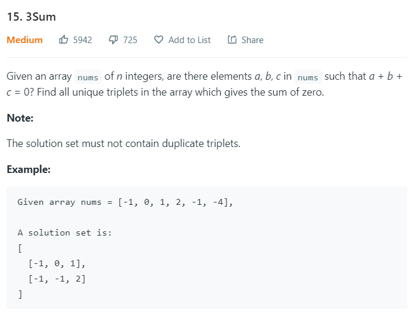</p>

<p>This problem adds a layer over our usual two pointer approach. What is that layer? Sorting! What does sorting achieve in this scenario? First off, we notice that there is a simple brute force solution to this problem i.e. forming a triple for loop and finding the triplets that sum up to the given value. But this is ugly and your interviewer will ask you to optimize. Well, since a two pointers approach can only observe two values at a time we won't be able to use that approach. Or could we? We definitely wouldn't be able to find a 3sum in O(N) but what about O(N^2) which is, after all, better than O(N^3). This is where we start thinking along the lines of sorting. Sorting will not disturb the O(N^2) time complexity of our algorithm because we can sort an array in O(Nlog(N)). On sorting, we consider an element centric approach where we move from element to element and check if there exist two greater numbers that sum up to the remaining value using a two pointers approach. We also have to account for unique triplets so we skip values if we have already encountered them.</p>

```cpp
class Solution {
public:
    vector<vector<int>> threeSum(vector<int>& nums) {
        //First, we sort.
        sort(nums.begin(), nums.end());
        vector<vector<int>> res;
        int pos = 0;
        //iterate throught each number in the sorted list one by one.
        for(int i = 0; i < nums.size(); i++){
            //continue if we have already dealt with this value 
            //of 'it' because we only want unique triplets in our result vector.
            if(i != 0 && nums[i] == nums[i-1]){
                continue;
            }
            //initialize our two pointers
            int start = i+1;
            int end = nums.size() - 1;
            while(start < end){
                //again we only want uniques so we advance 
                //start or end if we have already accounted for the numbers pointed by them.
                if(start != i+1 && nums[start] == nums[start-1]){
                    start += 1;
                    continue;
                }else if(end != nums.size() - 1 && nums[end] == nums[end + 1]){
                    end -= 1;
                    continue;
                }
                //Check three possible cases.
                if(nums[i] + nums[start] + nums[end] == 0){
                    res.push_back({nums[i], nums[start], nums[end]});
                    start += 1;
                    end -= 1;
                }else if (nums[i] + nums[start] + nums[end] < 0){
                    start += 1;
                }else{
                    end -= 1;
                }
            }
        }
        return res;
    }
};
```
## Searching :snowman:
<p>Often, we are presented with one or more sorted arrays or semi-sorted arrays. When the interviewer provides you with this information, you will need to take advantage of it to reduce the time complexity of the solution. The best way to take advantage of this is by using a binary search or some equivalent that yields an O(log(N)) time complexity.</p>
<p>The solution to a problem may not always be direct binary search. You may have to handle a few extra cases or edge cases but the solution is almost always "Binary Search-esque." For example, consider Leetcode problem <a href="https://leetcode.com/problems/search-in-rotated-sorted-array/">33</a>.</p>

<p align="center">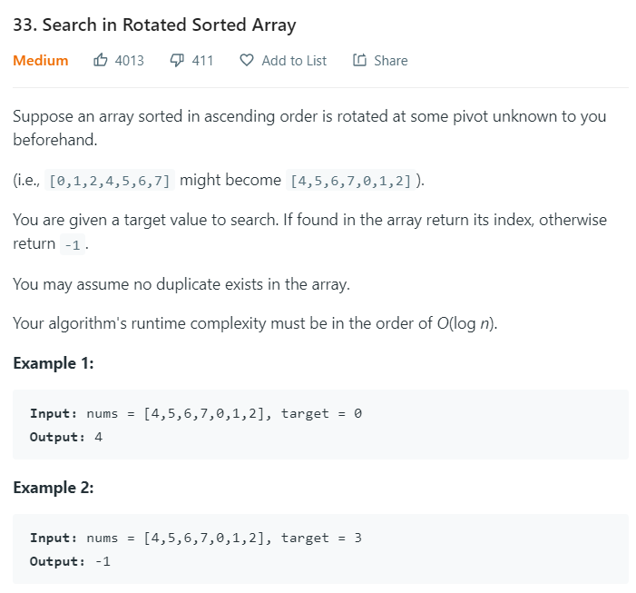</p>

<p>What would the brute force solution be in this case? Well, simply searching each element one by one in a simple for loop. But we didn't take advantage of the fact that it is rotated sorted, i.e. the array can be divided into two sorted parts. Now if we want logarithmic time, we could simply perform a binary search on each part of the list to find the target element. So the key to the solution of the problem is finding the pivot i.e. the smallest element which divides the array into the two sorted parts. We find the pivot using a modified version of binary search.</p>

```cpp
class Solution {
public:
    int search(vector<int>& nums, int target) {
        //Note that we use start and end twice, once to find the pivot
        //and again to find the target element.
        int start = 0;
        int end = nums.size() - 1;
        int pivot_index = 0;

        //first we attempt to find the pivot if there exists any.
        while(start <= end){
            int mid = (start + end) / 2;
            if(mid == 0 || mid == nums.size() - 1){
                start = 0;
                end = nums.size() - 1;
                break;
            }else if(nums[mid] > nums[mid+1]){ //discrepency in increasing order of sort indicates
                                               //we have found the pivot. 
                if(target <= nums[mid] && target >= nums[0]){
                    start = 0;
                    end = mid;
                }else{
                    start = mid + 1;
                    end = nums.size() - 1;
                }
                break;
            }else if(nums[mid] < nums[mid-1]){
                if(target <= nums[mid-1] && target >= nums[0]){
                    start = 0;
                    end = mid-1;
                }else{
                    start = mid;
                    end = nums.size() - 1;
                }
                break;
            }else{
                if(nums[mid] > nums[start]){
                    start = mid + 1;
                }else{
                    end = mid - 1;
                }
            }
        } 
        //if start has crossed end then there is no rotations and we can perform a single binary
        //search on the entire array.
        if(start >= end){
            start = 0;
            end = nums.size() - 1;
        }

        //Now that we know which sorted part of the array consists of the element, we perform binary search on that part.
        while(start <= end){
            if(nums[start] == target){
                return start;
            }else if(nums[end] == target){
                return end;
            }
            int mid = (start + end) / 2;
            if(nums[mid] == target){
                return mid;
            }else if (nums[mid] < target){
                start = mid + 1;
            }else{
                end = mid - 1;
            }
        }
        return -1;
    }
};
```
## Logical Problems :lock:
<p>Some array problems are simply math-based problems where we have to summon our math/logic skills. Sadly, there is no definite approach that we can use to solve such problems. The only way that we stand a good chance at solving such problems is solving more problems! Consider Leetcode problem <a href="https://leetcode.com/problems/rotate-image/">48</a>.</p>

<p align="center">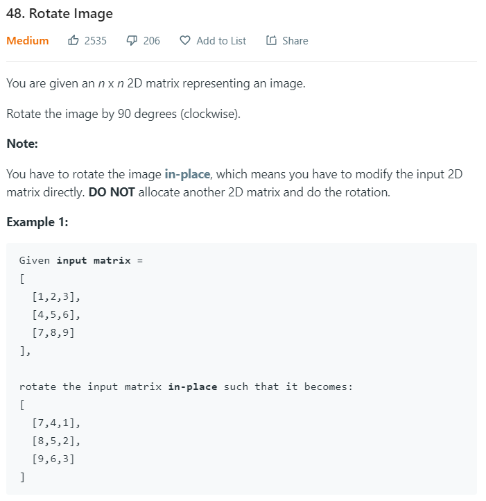</p>

<p>At first glance, this problem seems rather simple. You pull out a pen and work through an example, you see a definite pattern where each element, on rotation, is taking the place of another element which is located at a definite number of places away in the matrix. However, while it seems like a definite pattern, coming up with an element-wise algorithm is tedious. Moreover, since we have to do it in place, swapping two elements will make us lose track of the element that already exists at the position we are swapping into. This is where we need to apply some kind of logic to the problem. We do this by breaking down the rotation into two predictable operations, i.e. a reflection about the middle row followed by a reflection about the diagonal. Note that swapping is not a problem here because when we swap, both elements are being swapped into their final positions.</p>

```cpp
class Solution {
public:
    void rotate(vector<vector<int>>& matrix) {
        //first we reflect about the middle row.
        reverse(matrix.begin(), matrix.end());
        //now we reflect about the diagonal.
        for(int i = 0; i < matrix.size(); i++){
            for(int j = i+1; j < matrix.size(); j++){
                swap(matrix[i][j], matrix[j][i]);
            }
        }
    }
};
```
## Practice :muscle:
<p>These are some of the techniques that we use when solving array problems. While most of these techniques seem rather abstract, knowing them will allow us to nudge ourselves towards the right solution. Now that you have been equipped with these techniques, attempt to solve the following problems. If you get stuck, don't worry, we've got your back. Feel free to peek at the solution in the solutions directory or if you don't want to, zoom into office hours!</p>
1. <a href="https://leetcode.com/problems/first-missing-positive/">Leetcode Problem 41: First Missing Number</a><br>
2. <a href="https://leetcode.com/problems/trapping-rain-water/">Leetcode Problem 42: Trapping Rain Water</a><br>
3. <a href="https://leetcode.com/problems/find-all-numbers-disappeared-in-an-array/">Leetcode Problem 448: Find All Numbers Disappeared In An Array</a><br>
4. <a href="https://leetcode.com/problems/beautiful-arrangement-ii/">Leetcode Problem 667: Beautiful Arrangement ii</a><br>
5. <a href="https://leetcode.com/problems/fruit-into-baskets/">Leetcode Problem 904: Fruit Into Baskets</a>

# Strings <a name="strings"></a> :ramen:
<p>Array problems are often interchangable with string problems. After all, a string is an array of characters! When solving string problems, we might have to employ the two pointers approach that we discussed and sometimes even sorting (where alphabetical ordering matters). But there are a few new tricks that we could employ to solve string problems. Remember! if we can solve string problems using array techniques, we can solve array problems with string techniques.</p>

<p align="center"></p>

## Using A Hashtable :rocket:
<p>What's so cool about strings and characters is that they are hashable. We can associate a character, sub-string or string with a certain value that we would like to keep track of for each character, sub-string or string respectively. This could be the number of times it appears or even the position of the character in a string or string in an array. Let us illustrate the use of a hashtable with Leetcode problem <a href="https://leetcode.com/problems/longest-substring-without-repeating-characters/">3</a>.</p>

<p align="center">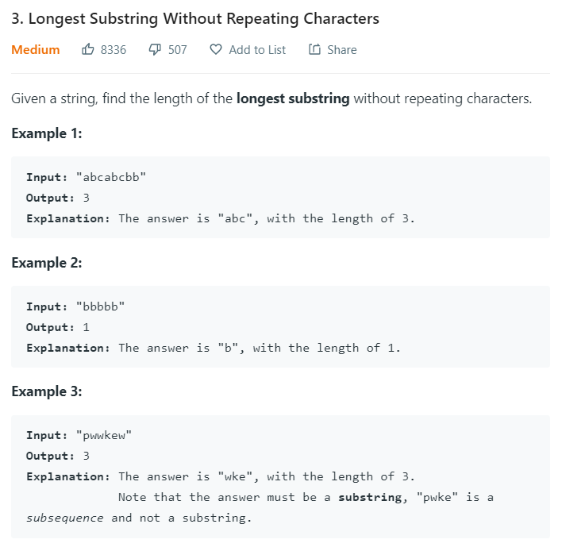</p>

<p>In order to find the longest substring with non-repeating characters, we keep track of the last seen position of each character in the string. This way we know that the next sub-string that we observe has to begin at the next position of the last seen position.</p>

```cpp
class Solution {
public:
    int lengthOfLongestSubstring(string s) {
        unordered_map<char, int> seen;
        int start = 0;
        int end = 0;
        int longest_len = 0;
        while(start != s.length() && end != s.length()){
            if(seen.find(s[end]) == seen.end() || seen[s[end]] < start){
                seen[s[end]] = end;
                if(end - start + 1 > longest_len)
                    longest_len = end - start + 1;
                end += 1;
            }
            else{
                start = seen[s[end]] + 1;
                seen[s[end]] = end;
                end += 1;
            }
        }
        return longest_len;
    }
};
```
## Sliding Window :running:
<p>Another greedy approach to solving string problems is using a sliding window of a fixed size to slide across our string while we check constraints and keep track of some values. A sliding window is essentially a range of characters in our string that starts from the beginning and terminates a fixed-length before the end of the string. The concept is better illustrated in this figure from <a href="https://tinyfool.org/2019/04/the-sliding-window-algorithm/">TinyFool's blog.</a></p>

<p align="center">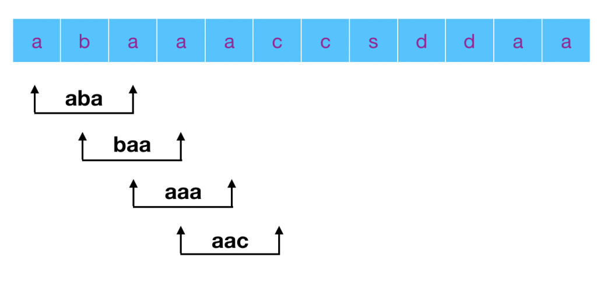</p>

<p>In the above figure, the window is three characters wide and slides across from the beginning to the end. We need to make sure to check edge cases and not slide out of bounds. Let us work through a problem that makes use of the sliding window technique. Consider Leetcode problem <a href="https://leetcode.com/problems/substring-with-concatenation-of-all-words/">30</a>.</p>

<p align="center">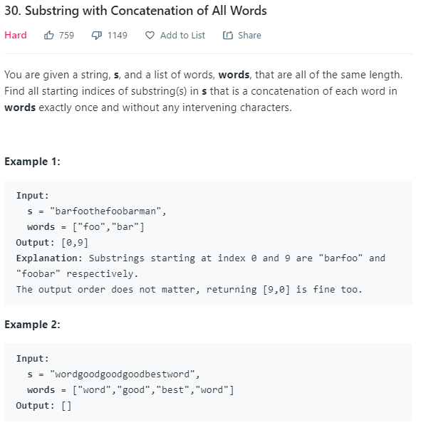</p>

<p>The above problem requires using both the techniques that we just learned. A hash table to keep track of the which words are present in the words vector and the number of times each one occurs, and a sliding window of some length to slide across all possible candidate substrings that are of that length. On close observation, we notice that the length of the window is going to be the total number of characters in the words vector. This is because every concatenation of all words will be of that fixed length. Now we just slide our window across the string. For each candidate, we check if all the individual words in the words vector are present. We do this by counting backward, decrementing the count of a word in a copy of the previously constructed hash table every time we encounter a valid word. We also count the number of words encountered to ensure that we account for exactly the right number of words. The time complexity of the above algorithm is going to be O((N-K) * K) where K is the length of the concatenated string and N is the length of the given string.</p>

```cpp
class Solution {
public:
    vector<int> findSubstring(string s, vector<string>& words) {
        //result we are going to return
        vector<int> result;
        //handle edge cases
        if(s == "" || words.size() == 0) 
            return result;
        //we obtain the length of each word in words vector and the size of the window
        //we will be considering.
        int word_len = words[0].length();
        int window_len = words.size() * word_len;
        //handle invalid case where our window is bigger than our string.
        if(window_len > s.size())
            return result;
        //create a hash table to keep track of words in the words vector and the number
        //of times each word appears. This will be used to check if a given window over 
        //the string s has a combination of any of these words
        unordered_map<string, int> word_counts;
        for(auto it : words){
            if(word_counts.find(it) == word_counts.end()){
                word_counts[it] = 1; 
            }else{
                word_counts[it] += 1;
            }
        }
        //iterate through all windows
        for(int i = 0; i <= s.size() - window_len; i++){
            //create a temporary hash map that will keep track of the words encountered
            //in this window.
            unordered_map<string, int> temp_words_counts(word_counts);
            int j = i;
            //number of words that are in the words vector which must be zero if we have
            //encountered all the words in our window.
            int count = words.size();
            while(j < i + window_len){
                //check every substring of length 'word_len'
                string temp = s.substr(j, word_len);
                //if the word is not in our words vector or even if it is but there are too many
                //break out of this window.
                if(word_counts.find(temp) == word_counts.end() || temp_words_counts[temp] == 0){
                    break;
                }else{
                    //else we decrement the count of that particular word and count, moving us
                    //closer to the result.
                    temp_words_counts[temp] -= 1;
                    count -= 1;
                }
                j += word_len;
            }
            //we have encountered all the words in this window in some permutation.
            //we add the starting index to our result vector.
            if(count == 0)
                result.push_back(i);
            
        }
        
        return result;
    }
};
```
## Practice :muscle:
<p>There are a few more types of string questions that one may encounter in technical interviews. These include Dynamic Programming, BFS/DFS, Topological Sort, etc. Don't worry, we'll cover these concepts when we get there. But for now, we will just work with the above problem-solving techniques. Remember to use the skills that you employed when solving array questions because they can come in handy as well.</p>

1. [Leetcode Problem 6: ZigZag Conversion](https://leetcode.com/problems/zigzag-conversion/)
2. [Leetcode Problem 32: Longest Valid Parentheses](https://leetcode.com/problems/longest-valid-parentheses/)
3. [Leetcode Problem 49: Group Anagrams](https://leetcode.com/problems/group-anagrams/)
4. [Leetcode Problem 767: Reorganize String](https://leetcode.com/problems/reorganize-string/)

# Linked Lists <a name="linkedlists"></a> :musical_note:
<p>Linked Lists are a pretty neat data structure. As you might have learned in CS 32, the beginning of the list is marked by the head and the end of the list is marked by a pointer to a null pointer. There are various kinds of linked lists like singly-linked lists, doubly linked lists, circular linked lists, etc. When it comes to technical interviews, you are most often going to deal with linked lists which are singly linked. Why? simply they are the most challenging algorithmically. You would have to take extra care when traversing a linked list to not make null access or keep track of the previous element because you will not be able to just step back if you need to access it. There are no particular linked list problem-solving techniques but the keen eye will catch a few tricks that we can employ when dealing with singly-linked lists.</p>

<p align="center"></p>

## Using a dummy node :smiley_cat:

<p>Let's take a look at one particular interesting trick that can help us solve a lot of linked list problems without worrying too much about edge cases. That trick is using a dummy pointer. Using a dummy pointer in the beginning and setting it to the head allows us to treat one and zero element lists no differently from linked lists with more than one node. Further, using a dummy head helps us to keep track of the head of the list easily. For example, if the head of the linked list is moved away and is no longer the linked list of the new re-ordered list, we can simply return the head of the list by returning the dummy's next pointer.</p>

<p align="center">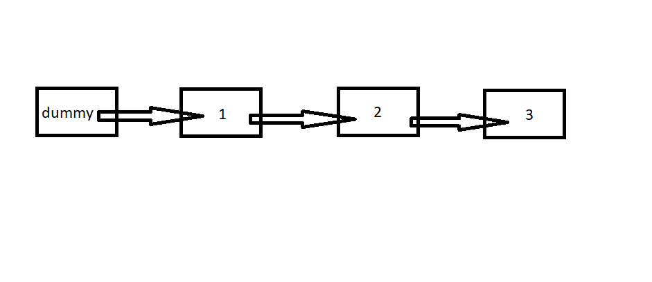</p>

<p>This trick is best illustrated with the following example. Consider Leetcode problem <a href="https://leetcode.com/problems/reverse-linked-list-ii/">92</a>.</p>

<p align="center">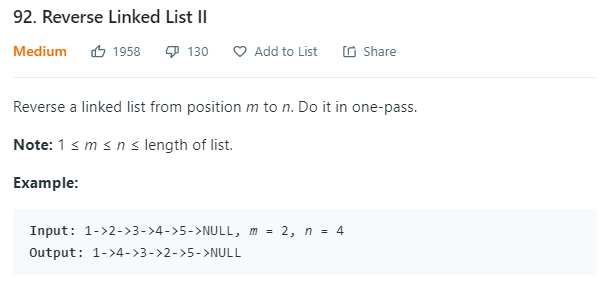</p>

<p>First off, we notice that this problem could get messy with the edge cases since it involves partially reversing a list. We attach a dummy node to the beginning of the list to avoid handling these special edge cases. Once we're done with that we iterate with a pointer 'prev' to the node just before the beginning of the sub-list we are going to reverse. We then set a pointer to point to the start of the list (i.e. the pointer 'start'). The idea now would be to move the start of the sub-list forward by moving the node to the next of the start of the sub-list to be just after the node 'prev'. We thus accomplish reversing the linked list in a single pass and in O(N) time where N is the number of nodes in the list. This is best illustrated with the following figure.</p>

<p align="center">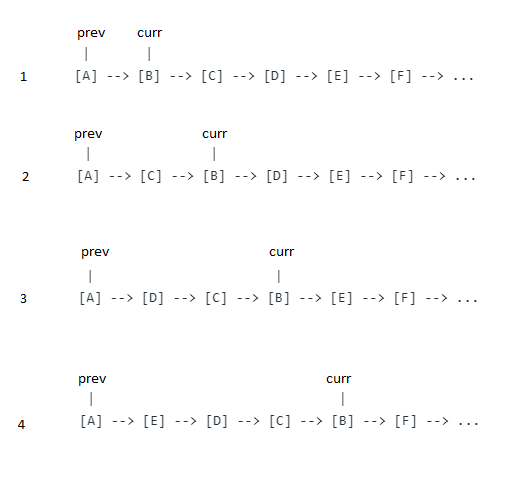</p>

```cpp
class Solution {
public:
   ListNode* reverseBetween(ListNode* head, int m, int n) {
       //create a dummy node.
       ListNode *dummy = new ListNode(0);
       dummy->next = head;
       ListNode* prev = dummy;
       //move the prev node until the node just before the start of
       //the sublist that we want to reverse.
       for(int i = 0; i < m-1; i++) prev = prev->next;
       ListNode* curr = prev->next;
       for(int i = 0; i < n-m; i++){
           ListNode* temp = prev->next;
           prev->next = curr->next;
           curr->next = curr->next->next;
           prev->next->next = temp;
           
       }
       return dummy->next;
   }
};
```

## Messy pointer movement :horse:

<p>The one problem unlike arrays that we face with linked is that the length of the linked list is not so easy to calculate. Luckily, we can determine the length of the linked list in O(N) time so it will not, in most cases, affect the time complexity of the algorithm. We need to be careful when we make generalizations regarding the math surrounding linked lists. We would have to handle some edge cases as best illustrated by the solution to the following problem. Consider the Leetcode problem <a href="https://leetcode.com/problems/rotate-list/">61</a>.</p>

<p align="center">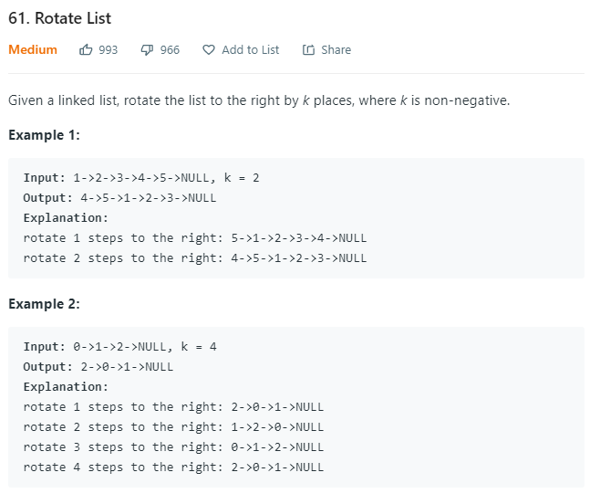</p>

<p>On close observation, we notice that we need to rotate the list about the kth node from the end as shown in the example above. This corresponds to the (length - k)th node where 'length' is the length of the linked list. We also need to be careful about the case when k is greater than the length of the linked list which simply means that we are rotating multiple times even after returning to the original configuration of the linked list one or more times. This can be handled by taking the remainder with the length of the list to obtain the effective number of places we are going to rotate the list. Once be determine the kth node from the end (or the (length-k)th node from the beginning) it is only a matter of moving some pointers around after which we reach our result configuration. The time complexity would be O(N) for this solution.</p>

```cpp
class Solution {
public:
    ListNode* rotateRight(ListNode* head, int k) {
        if(head == nullptr || head->next == nullptr || k == 0) return head;
        int length = 1;
        ListNode* tail = head;
        while(tail->next != nullptr){
            tail = tail->next;
            length += 1;
        }
        k = length - (k % length);
        if(k == length) return head;
        ListNode* newHead = head;
        ListNode* prev = nullptr;
        while(k){
            prev = newHead;
            newHead = newHead->next;
            k -= 1;
        }
        tail->next = head;
        prev->next = nullptr;
        return newHead;
    }
};
```

## A hard problem :rose:

<p>Lastly, let us attempt to solve a hard problem related to linked lists. Merging two sorted lists is pretty straight forward. If you have never attempted that problem, be sure to check that out first. We discuss the problem in the CS32 interview prep guide. Let us consider a harder problem i.e. Leetcode problem <a href="https://leetcode.com/problems/merge-k-sorted-lists/">23</a>. One where we merge K sorted lists. 

<p align="center">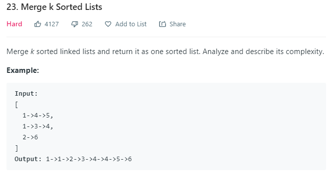</p>

<p>At first glance, the most basic idea derived from the implementation of the merge two lists is to take the list with the smallest head, add the element to our list and advance the head of that node by one. We keep doing this until all our lists' heads are at null which means we have successfully appended all the elements of our list to the end of our sorted list. The important aspect here is to deal with keeping track of which element to pick from the sorted lists. We would have to iterate through all the list head elements each time we add a new element making the time complexity of this approach O(N*K) where K is the number of sorted lists. If we want to do better, we have to exploit the fact that all the lists are already sorted.</p>

<p>We introduce the idea of a priority queue, a queue, often implemented as a heap, that keeps track of the order of elements. We define a custom comparison class for the priority queue so that it can store the linked lists' heads in a way that the head with the least value is at the front of our queue. This makes our algorithm efficient because when we pop a list from the queue, append the head node to our result list and advance the head pointer, we do this in constant time. The only costly operation here is to maintain the order of the queue which when implemented as a heap just takes log(K) time to reorder when we add a new head node to the queue. We do this O(N) times while constructing our N element sorted result list. This makes our algorithm more efficient as the time complexity is O(N*log(K)).
</p>

```cpp
//This is how we define a custom compare class for a priority queue in C++.
//The custom comparator takes in the heads of two sorted lists and
//returns true if the first list head is greater than that of the second.
//note that this is opposite to a custom comparator for the sort function because
//the priority queue defaults to storing the elements in decreasing order.
struct CompareHead { 
    bool operator()(ListNode* const& h1, ListNode* const& h2) 
    {  
        return h1->val > h2->val; 
    } 
}; 

class Solution {
public:
    ListNode* mergeKLists(vector<ListNode*>& lists) {
        //initialize a priority queue.
        priority_queue<ListNode*, vector<ListNode*>, CompareHead> Q;
        //use a dummy head to mark the beginning of the result linked list.
        ListNode* dummy = new ListNode(0);
        dummy->next = nullptr;
        ListNode* curr = dummy;
        //push all the linked lists in the lists vector into our priority queue
        //which orders them based on the custom comparator defined above.
        for(int i = 0; i < lists.size(); i++) {
            if(lists[i] != nullptr)
                Q.push(lists[i]);
        }
        //while we still have elements in the Priority Queue.
        while(Q.size()){
            ListNode* temp = Q.top();
            Q.pop();
            //append the popped head to the result linked list.
            curr->next = new ListNode(temp->val);
            curr = curr->next;
            curr->next = nullptr;
            //advance the head by one node if there are elements left in the
            //linked list.
            if(temp->next != nullptr)
                Q.push(temp->next);
        }
        return dummy->next;
    }
};
```

## Practice :muscle:
The best way to solve hard linked list problems is to get good at reversing lists, sublists, pairs of nodes etc. It always helps to draw out the linked list and visualize how the pointers have to move around before getting into actual code.


1. [Leetcode Problem 2: Add Two Numbers](https://leetcode.com/problems/add-two-numbers/)
2. [Leetcode Problem 138: Copy List With Random Pointer](https://leetcode.com/problems/copy-list-with-random-pointer/)
3. [Leetcode Problem 142: Linked List Cycle II](https://leetcode.com/problems/linked-list-cycle-ii/)

# Trees I <a name="trees1"></a>
<p>Trees are an important data structure that one often deals with during technical interviews. When we take a look at trees we won't just be understanding trees as a data structure but we will also be dealing with quite a few tree algorithms. Tree algorithms involve tree traversals, tree searches, maintaining a particular ordering of nodes in a tree, etc. We will also be looking into a special class of trees called Binary Search Trees and how we can perform a Binary Search on such a tree. For now, let us deal with problems involving simple rooted trees.</p>

<p align="center">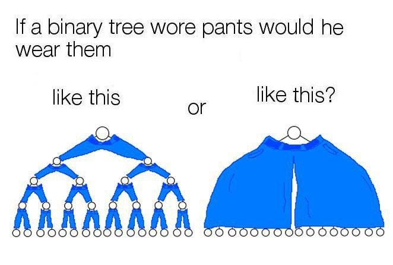</p>

## Tree Traversals
<p>A tree traversal is a walk through the entire tree visiting each node of the tree at least once. What order do we visit the nodes in? That is exactly what different tree traversals are all about, an ordering of the nodes. Let us consider In Order Traversal. Inorder traversal involves recursively visiting the left sub tree, followed by the root node and finally the right sub-tree. If we were asked to print the value of every node in a tree in order, we would perform an in order traversal like this.</p>

```cpp
void inorderTraversal(TreeNode* root){
    if(root == nullptr)
        return;
    inorder_traversal(root->left);
    cout << root->val;
    inorder_traversal(root->right);
    return;
}
```

<p>While the above function performs inorder traversal of a tree and the code looks beautiful: clean and simple, there is a better solution. Consider Leetcode problem <a src="https://leetcode.com/problems/binary-tree-inorder-traversal/">94</a>. While the solution is optimal in terms of time complexity (O(N) where N is the number of nodes in the tree since we are visiting each node exactly once), there is a more space efficient solution that can be achieved by taking an iterative approach. The recursive approach is more memory hungry as it takes up O(N) stack space. Allocating more stack space also slows down the recursion. So a faster and more memory efficient approach would be to perform the traversal iteratively.</p>

<p align="center">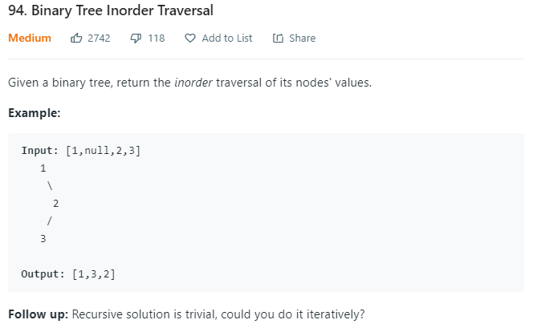</p>

<p>If do not want to use the memory stack because of the overhead, we will create our own stack to assist us with the traversal. Below is the solution to the stack-based iterative solution to performing an inorder traversal of a tree.</p>

```cpp
class Solution {
public:
    vector<int> inorderTraversal(TreeNode* root) {
        vector<int> result;
        stack<TreeNode*> nodes;
        TreeNode* curr = root;
        while(true){
            if(curr != nullptr){
                nodes.push(curr);
                curr = curr->left;
            }else{
                if(nodes.size() == 0){
                    break;
                }else{
                    TreeNode* temp = nodes.top();
                    nodes.pop();
                    result.push_back(temp->val);
                    curr = temp->right;
                }
            }
        }
        return result;
    }
};
```
<p>There are two other types of traversals, post-order traversal and pre-order traversal. Post-order traversal involves visiting the left sub-tree, the right sub-tree and then the root. Pre-order traversal involves visiting the root, followed by the left sub-tree, followed by the right sub-tree. The recursive implementation is naive and just involves moving around the recursive statements in the recursive implementation of in-order traversal. The iterative implementation of these two traversals is left as an exercise. Use the same technique that we discussed above. Do it!</p>

<p>Now that we know how to traverse the trees, let us attempt to construct a tree from the inorder and pre-order traversal orders. Consider Leetcode problem <a src="https://leetcode.com/problems/construct-binary-tree-from-preorder-and-inorder-traversal/">105</a>.</p>

<p align="center">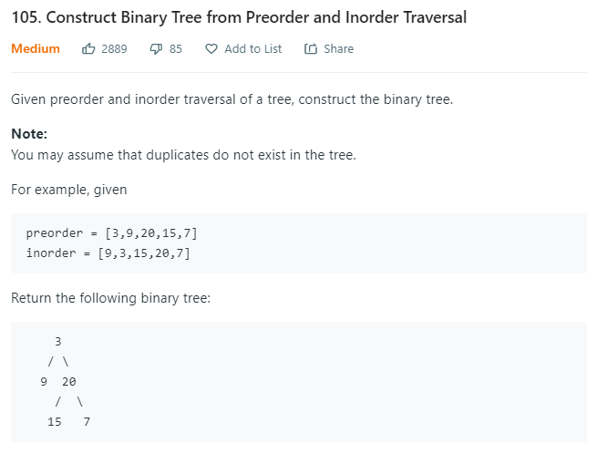</p>

<p>This problem is all about using the right pointers. Upon close observation of the inorder and preorder lists, we notice that subtrees are grouped together. The nodes of the left subtree is grouped together in the preorder and inorder lists. The same goes to the left. So we can take advantage of this grouping in our recursion. We maintain 4 pointer in each recursive call. The start of the preorder list, the end of the preorder list, the start of the inorder list and the end of the inorder list. During the call we generate eight new pointers, the four mentioned pointers for the left and right subtrees of the root.</p>

```cpp
/**
 * Definition for a binary tree node.
 * struct TreeNode {
 *     int val;
 *     TreeNode *left;
 *     TreeNode *right;
 *     TreeNode() : val(0), left(nullptr), right(nullptr) {}
 *     TreeNode(int x) : val(x), left(nullptr), right(nullptr) {}
 *     TreeNode(int x, TreeNode *left, TreeNode *right) : val(x), left(left), right(right) {}
 * };
 */
class Solution {
public:
    
    TreeNode* buildTreeHelper(vector<int>& preorder, vector<int>& inorder, int preorder_start, int preorder_end, int inorder_start, int inorder_end){
        if(preorder_start >= preorder_end || inorder_start >= inorder_end)
            return nullptr;
        
        int root = preorder[preorder_start];
        int iroot;
        for(int j = inorder_start; j < inorder_end; j++){
            if(inorder[j] == root){
                iroot = j;
                break;
            }
        }
        TreeNode* rootptr = new TreeNode(root);
        int length_of_left_list = iroot - inorder_start;
        int new_preorder_start_left = preorder_start + 1;
        int new_preorder_end_left =  preorder_start + length_of_left_list + 1;
        int new_preorder_start_right = new_preorder_end_left;
        int new_preorder_end_right = preorder_end;
        int new_inorder_start_left = inorder_start;
        int new_inorder_end_left = iroot;
        int new_inorder_start_right = iroot + 1;
        int new_inorder_end_right = inorder_end;
        rootptr->left = buildTreeHelper(preorder, inorder, new_preorder_start_left, new_preorder_end_left, new_inorder_start_left, new_inorder_end_left);
        rootptr->right = buildTreeHelper(preorder, inorder, new_preorder_start_right, new_preorder_end_right, new_inorder_start_right, new_inorder_end_right);
        return rootptr;
    }
    
    TreeNode* buildTree(vector<int>& preorder, vector<int>& inorder) {
        return buildTreeHelper(preorder, inorder, 0, preorder.size(), 0, inorder.size());
    }
};
```

<p>Now that we are comfortable with recursion, let us deal with a classic problem that a lot of companies like to ask in their interviews. This is Leetcode problem <a href="https://leetcode.com/problems/lowest-common-ancestor-of-a-binary-tree/">236</a>.</p>

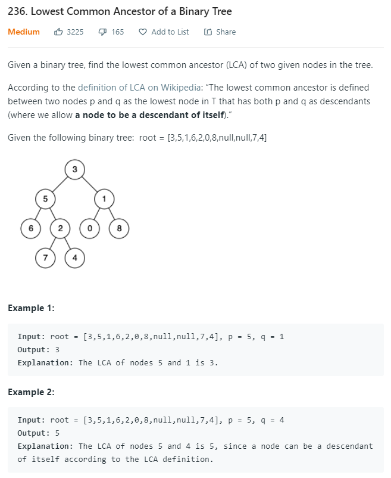

<p>So how do we identify the Lowest Common Ancestor (LCA) of two nodes p and q? Well first let's ask the question how do we identify the nodes p and q? It is pretty straight-forward, we perform a preorder traversal of the tree. Once we do find p or q, we need to propogate the information that we found p or q up to the ancestors. The best way to do that would be to return the pointer to the node. When we move beyond a leaf, we just return the null pointer. So a null pointer would indicate that we have found neither p or q among its successors and a non-null pointer would indicate that we did find p or q. If the recursive call on the left subtree and the right subtree both return non-null pointers, then we have found the LCA and we propogate a pointer to the LCA upwards.</p>

```cpp
/**
 * Definition for a binary tree node.
 * struct TreeNode {
 *     int val;
 *     TreeNode *left;
 *     TreeNode *right;
 *     TreeNode(int x) : val(x), left(NULL), right(NULL) {}
 * };
 */
class Solution {
public:
    TreeNode* lowestCommonAncestor(TreeNode* root, TreeNode* p, TreeNode* q) {
        if(root == nullptr)
            return nullptr;
        if(root == p || root == q)
            return root;
        else{
            TreeNode* l = lowestCommonAncestor(root->left, p, q);
            TreeNode* r = lowestCommonAncestor(root->right, p , q);
            if(l == nullptr && r == nullptr)
                return nullptr;
            else if(l != nullptr && r == nullptr)
                return l;
            else if(l == nullptr && r != nullptr)
                return r;
            else
                return root;
        }
    }
};
```
## Practice :muscle:
1. [Leetcode Problem 102: Binary Tree Level Order Traversal](https://leetcode.com/problems/binary-tree-level-order-traversal/)
2. [Leetcode Problem 144: Binary Tree Preorder Traversal](https://leetcode.com/problems/binary-tree-preorder-traversal/)
3. [Leetcode Problem 99: Binary Tree Inorder Traversal](https://leetcode.com/problems/binary-tree-inorder-traversal/)
4. [Leetcode Problem 145: Binary Tree Postorder Traversal](https://leetcode.com/problems/binary-tree-postorder-traversal/)
5. [Leetcode Problem 114: Flatten Binary Tree to Linked List](https://leetcode.com/problems/flatten-binary-tree-to-linked-list/)

# Topological and Heap Sort <a href="topologicalandheapsort"></a> :palm_tree:
## Topological Sort :earth_americas:
<p>Topological sort is a sorting technique that can be applied on elements with some precedence order associated with each element. There is, however, an important caveat concerned with topological sort: the elements which can be topologically sorted have form a Directed Acyclic Graph. We will examine Directed Acyclic Graphs in the upcoming section, but just so that you don't lose sight of our goal of finding a precedence order for elements, we can only determine precedence order only if there are no cyclic dependencies. For example, if we state that an element A comes before element B, and element B comes before element C then if A, B and C can be topologically sorted, C cannot come before A.</p>

<p>So what is a Directed Acyclic Graph? Well it's a graph that is directed and acyclic, i.e. all the edges of the graph are directed and there are no cycles in the graph. This is best illustrated by the following graph.</p>

<p align="center">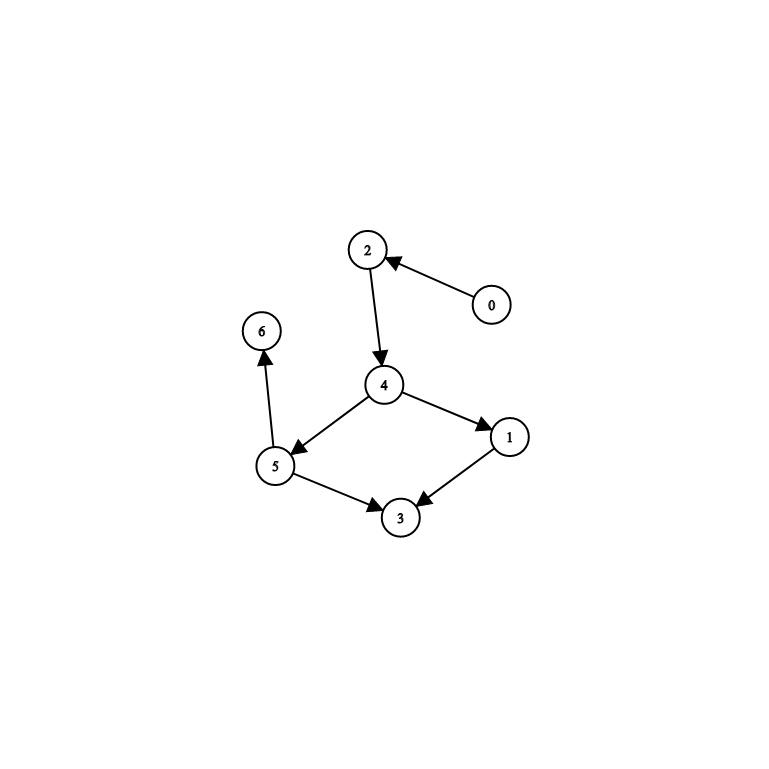</p>

<p>Notice that in the above graph all the edges are directed and there are no cycles. 4, 1, 3 and 5 do not form a cycle because the edge between 3 and 5 is opposite to the direction of the cycle. Great, we have established that the above graph is a DAG, but how does this relate to topological ordering? Well, if each directed edge from a node u to a node v implies that u "precedes" v, we can extract a topological ordering from the above graph. So for the above graph, one possible topological ordering would be 0 2 4 1 5 3 6. Let us call this ordering a. Notice that for any two elements ai and aj in the ordering such that i < j, if a directed edge exists in the graph between ai and aj, it has to be from ai to aj. We can never find an edge from aj to ai. Ofcourse, it is also possible that no edge exists between ai and aj, simply implying that ai doesn't have to precede aj and similarly aj doesn't have to precede ai.</p>

<p>Given a DAG, let us study the algorithm that is used for topological sort. The main idea behind this algorithm is to keep track of the nodes which have no incoming vertices. In a topological ordering, notice that the first element, 0, is a node with no incoming vertices in the DAG. Great! we figured out how to determine the first element! Now what? Well, let us remove 0 from the DAG. Make sure to remove the outgoing edge from 0 as well. Now, let us observe the node with no incoming vertices. It is 2! And just like that, we have determined the second node in the graph. This is no coincidence! we keep doing that until we run out of nodes in the DAG: removing the node with 0 incoming vertices and then updating the list of nodes with no incoming vertices until we empty the graph. If at any point we have run out of nodes with no incoming vertices but we still have nodes left over in the graph, then a cycle must exist and the nodes of the DAG cannot be topologically sorted.</p>

<p>Now that we know the algorithm, let's try implementing the algorithm to solve a problem. Consider Leetcode problem <a src="https://leetcode.com/problems/course-schedule/">207</a>.</p> 

<p align="center"></p>

<p>For this problem we use topological sort in order to determine if the course ordering is valid. We can think of a course ordering as a directed graph where each node is a course. There is a node pointing from node A to a node B if A is a pre-requisite of B. If a course schedule is valid then the graph formed must be a DAG so that we can take one course at a time without running into a cyclic dependency. We determine the topological ordering and if one can be determined successfully we know the given course schedule forms a DAG. We use the standard algorithm for determining a topological ordering from a DAG to solve the problem.</p>

```cpp
class Solution {
public:
    bool canFinish(int numCourses, vector<vector<int>>& prerequisites) {
        int input_degree[100000] = {0};
        unordered_map<int, vector<int>> edges;
        queue<int> proc;
        vector<int> order;
        for(auto prereq : prerequisites){
            input_degree[prereq[0]] += 1;
            edges[prereq[1]].push_back(prereq[0]);
        }
        for(int i = 0; i < numCourses; i++){
            if(input_degree[i] == 0) proc.push(i);
        }
        while(proc.size()){
            int temp = proc.front();
            proc.pop();
            for(int i = 0; i < edges[temp].size(); i++){
                input_degree[edges[temp][i]] -= 1;
                if(input_degree[edges[temp][i]] == 0) proc.push(edges[temp][i]);
            }
            order.push_back(temp);
        }
        return order.size() == numCourses;
    }
};
```
## Heap Sort :milky_way:
<p>Now on to heap sort. Well as the name suggests, Heap Sort is a sorting algorithm that employs heaps. Heaps as we all know from CS32 is a data structure that is used to maintain a particular order in elements, most commonly, in the form of a min heap or a max heap. A min heap maintains the elements in an order such that the minimum element is the topmost element of the heap, and every element is less than that its children (if children exist). Heap sort, just like any sorting algorithm is bounded by O(NlogN) time complexity. In C++ a heap is used to implement a priority queue. A priority queue can be used to maintain a custom ordering of just about anything. We would have to declare a custom comparision class in order to do so but this is often easier than it sounds as we will see in the upcoming examples.</p>

<p align="center"></p>

<p>So the way heap sort would work would be to arrange all the elements to be sorted in a heap and then keep popping the topmost element until there are no remaining elements. The order in which the elements are popped is the heap sort ordering! While heap sort achieves what any other equally efficient algorithm like merge sort or pivot sort would achieve, the heap data structure itself (priority queue in C++) can be very useful in several interview problems. Consider Leetcode problem <a href="https://leetcode.com/problems/top-k-frequent-elements/">347</a>.</p>

<p align="center">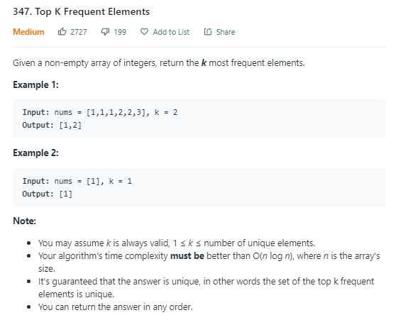</p>

<p>We solve this problem by making use of a heap. The problem asks us to do better than O(NlogN) time complexity so we achieve a time complexity of O(NlogK) using a priority queue which stores the K most frequent elements. We maintain the element value and its frequency in a pair. We spend O(N) time constructing the unordered map to store element, frequency key-value pairs in order to construct our pair easily. Then we insert pairs into the priority queue while maintaining the restriction that there can only be K elements in the priority queue. As promised we write a custom comparision struct that our heap will use to order the pairs. The second element in the pair is the frequeuncy of the first element. Once we are done passing through all pairs, the elements remaining in our priority queue are the our top K frequent elements in the vector nums. Note that we have to define a custom comparator for the priority queue in order to compare pairs.</p>

```cpp
class Solution {
public:
    struct CustomCompare { 
        bool operator()(pair<int, int> n1, pair<int, int> n2) 
        {  
            return n1.second > n2.second;
        }
    };
    vector<int> topKFrequent(vector<int>& nums, int k) {
        vector<int> result;
        unordered_map<int, int> counts;
        for(int i = 0; i < nums.size(); i++) counts[nums[i]] = 0;
        for(int i = 0; i < nums.size(); i++) counts[nums[i]] += 1;
        priority_queue<pair<int, int>, vector<pair<int, int>>, CustomCompare> Q;
        for(auto iter : counts){
            if(Q.size() < k){
                Q.push(iter);
            }else{
                pair<int, int> n1 = Q.top();
                if(counts[n1.first] < counts[iter.first]){
                    Q.pop();
                    Q.push(iter);
                }
            }
        }
        while(Q.size()){
            result.push_back(Q.top().first);
            Q.pop();
        }
        return result;
    }
};
```

<p>Lets tackle Leetcode problem <a href="https://leetcode.com/problems/split-array-into-consecutive-subsequences/">659</a> using heaps. While the use of heaps to solve this problem is not optimal, it does allow us to get creative with using heaps to solve problems. Try working out the more optimal greedy solution on your own!</p>

<p align="center">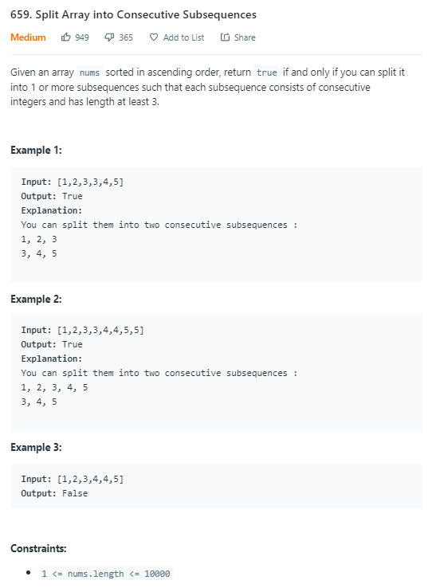</p>

<p>We maintain a priority queue for each number nums[i] that appears in the vector nums passed into the function. The priority queue will contain all the continuous increasing subsequences encountered thus far ending with the number nums[i] and will be ordered in increasing order of size (i.e. fewer the elements in the subsequence, the higher up in the priority queue). So we need a custom comparision struct to order the subsequences. That way, for any element nums[i] that we encounter in the vector nums, we can append it to the shortest consecutive increasing subsequence that ends with the number nums[i]-1. If there is no such subsequence, we create a new one with the first element being nums[i]. The time complexity for this solution is O(NlogN) where N is the number of distinct elements in the vector nums.</p>

```cpp
class Solution {
public:
    struct CustomCompare { 
        bool operator()(vector<int>* v1, vector<int>* v2) 
        {  
            return v1->size() > v2->size();
        }
    };
    
    bool isPossible(vector<int>& nums) {
        unordered_map<int, priority_queue<vector<int>*, vector<vector<int>*>, CustomCompare>> heaps;
        for(int i = 0; i < nums.size(); i++){
            if(heaps.find(nums[i]-1) == heaps.end() || heaps[nums[i]-1].size() == 0){
                vector<int>* v = new vector<int>;
                v->push_back(nums[i]);
                heaps[nums[i]].push(v);
            }else{
                vector<int>* v = heaps[nums[i]-1].top();
                heaps[nums[i]-1].pop();
                v->push_back(nums[i]);
                heaps[nums[i]].push(v);
            }
        }
        bool is_valid = true;
        for(auto it : heaps){
            if(it.second.size() != 0){
                if(it.second.top()->size() < 3){
                    is_valid = false;
                    break;
                }
            }
        }
        return is_valid;
    }
};
```

## Practice :muscle:
1. [Leetcode Problem 329: Longest Increasing Path In A Matrix](https://leetcode.com/problems/longest-increasing-path-in-a-matrix/)
2. [Leetcode Problem 1203: Sort Items By Groups Respecting Dependencies](https://leetcode.com/problems/sort-items-by-groups-respecting-dependencies/)
3. [Leetcode Problem 215: Kth Largest Element In An Array](https://leetcode.com/problems/kth-largest-element-in-an-array/)
4. [Leetcode Problem 23: Merge K Sorted Lists](https://leetcode.com/problems/merge-k-sorted-lists/)
5. [Leetcode Problem 210: Course Schedule II](https://leetcode.com/problems/course-schedule-ii/)